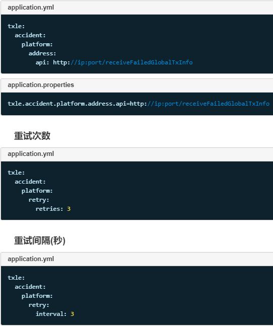

# 上报异常至差错处理平台

+ 简介

    分布式事务主要保证数据的一致性，如果业务出现异常情况，则会回滚掉所有执行过的子事务。然而，一些异常是系统无法抗拒与处理的(如数据被篡改)，会导致全局事务回滚失败，此时系统会将事务信息上报至差错平台，供相关人员查阅及制定处理方案。

+ 配置

    

+ 上报时机

    自动补偿失败时，系统将上报相关信息至差错平台。
    
    手动补偿失败时，由于手动补偿接口由业务人员自行开发维护，故业务人员在编写手动补偿接口时需自行追加上报至差错平台相关代码，参考如下。
    
    如图：
    
    

+ 监控指标

    + 上报成功数量指标 - txle_report_accident_successful_total

        记录成功上报至差错平台的数量。

    + 上报失败数量指标 - txle_report_accident_failed_total

        记录上报至差错平台失败的数量。

+ 告警

    每次抓取到新的失败记录，将触发告警。

    告警规则配置，在alert.rules文件中追加如下代码：
  
    
