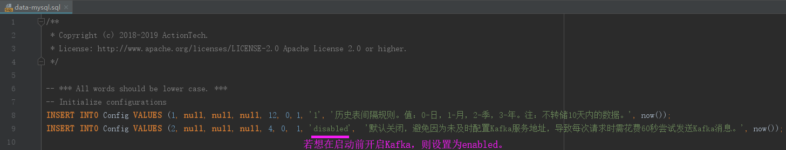

# 上报消息至Kafka平台

+ 简介

  因子业务无法确定全局事务是否成功完成，即数据是否最终达到一致性，故各子事务不能直接去刷新缓存数据。
  因此，需等待全局事务完成(无论成功失败)后，将全局事务内部所有子事务执行后影响的数据信息上报到消息管理平台(即Kafka)，由各子事务自行订阅刷新缓存。

+ 消息数据表

  

+ 集成逻辑

  + 收集数据信息

    即数据表Message中有关业务上的字段值信息，如数据库驱动、数据库连接地址、数据库用户名、数据表名称、编辑操作类型、影响数据标识集合。

  + 自动补偿场景收集

    生成自动补偿信息过程中，收集子事务所影响的业务数据。

  + 手动补偿场景收集

    因子事务的业务逻辑未知，可能存在数据库方面影响的数据与业务上影响数据不一致，所以应由各子事务自行实现收集所影响的业务数据。

    手动补偿情况业务开发人员调用上报Kafka消息的示例代码：
    ```
    @Autowired
    private MessageSender messageSender;
    
    public ... rollback... {
        // 业务代码....
    
        // 手动补偿场景：由业务人员自行收集所影响的数据信息
        messageSender.reportMessageToServer(new KafkaMessage(...));
    }
    ```
  + 调用统一上报接口

    ```
    org.apache.servicecomb.saga.omega.transaction.MessageSender#
    reportMessageToServer(org.apache.servicecomb.saga.omega.transaction.KafkaMessage message);
    ```
  + 上报逻辑

    采用gRPC方式进行上报

    新增报文消息的proto文件GrpcMessage.proto

    逻辑与客户端传输Event到服务端一致，并与其共用同一Endpoint

  + TXLE服务端存储业务信息至数据库

    即将客户端收集到的业务影响数据保存到数据表Message中。

  + TXLE服务端发送业务信息至Kafka服务端

    当全局事务结束后，读取数据表Message中相关消息列表，将整个全局事务的消息列表一次性发送至Kafka服务端。

  + 发送成功

    更新数据表Message中的消息状态status为发送成功。

    记录日志。

  + 发送失败

    更新数据表Message中的消息状态status为发送失败。

    记录日志。

    上报差错平台。

+ 配置文件与热加载

    - 配置文件：..\txle\alpha\alpha-server\src\main\resources\kafka.properties。

      ps: 在测试与生产环境使用前，请先依据当时环境对此文件进行调整，如bootstrap.servers、topic、acks等。

    - 默认不启用Kafka

      可在启动服务前通过修改配置文件开启Kafka。

      

      当然，也可以通过txle-ui服务进行配置。

    - 热加载

      可调用RESTful Api接口：http://ip:port/reloadConfig/kafka，对kafka.properties文件进行热加载。
