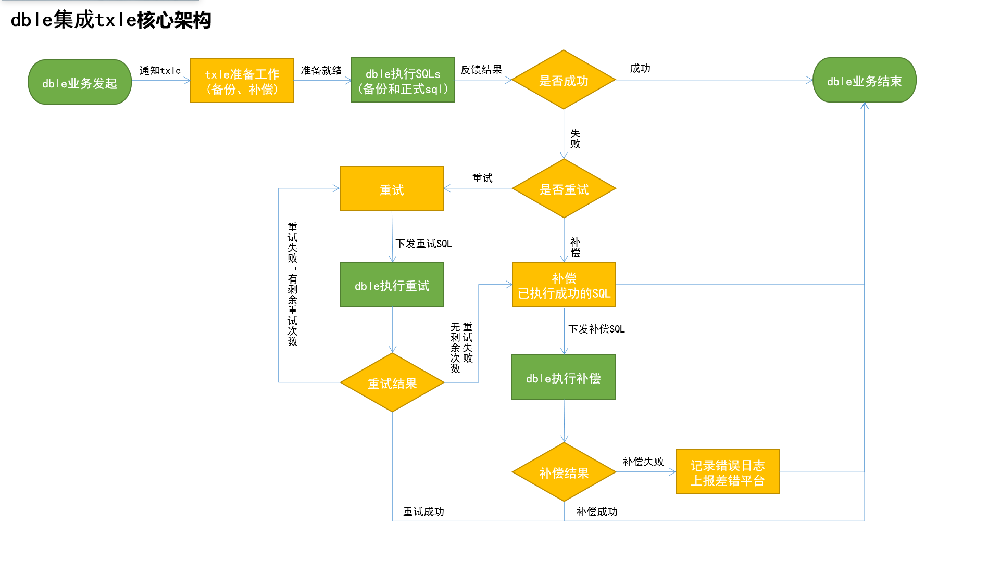

# GRPC接口集成

- 简介

  继现有客户端jar包集成方式后，txle系统推出了GRPC接口集成方式。即第三方客户端与txle服务端主要通过gRPC框架进行通信，以实现解耦、支持异构语言等特性。

  此方式主要解决了客户端jar包方式的部分问题：如第三方系统需由Java语言编写，且需采用Spring框架，并需要同一笔业务在同一线程内完成。

  

- 兼容性
  - 支持未使用注解的第三方系统
  - 支持一笔业务不在同一线程内完成
  - 对系统采用框架无要求
  - 支持异构语言

- 支持功能

  相比客户端jar包集成方式的[<u>核心功能</u>](https://actiontech.github.io/txle-docs-cn/3.CoreFunctions/3.0_overview.html)，除客户端功能和手动补偿外，支持其它所有功能，且在重试过程中支持超时功能。

  客户端jar包集成方式的重试和超时均在补偿注解中设置，而gRPC接口集成方式直接在事务中设置。

- 集成步骤
  - 第三方系统需要引入grpc相关依赖，可参考文件[<u>pom.xml</u>](https://github.com/actiontech/txle/blob/20200324/examples/sample-txle-springboot/sample-txle-springboot-grpcclient/pom.xml)(若系统已支持，则忽略)

  - 下载文件[<u>TxleGrpcTransaction.proto</u>](http://10.186.18.11/confluence/download/attachments/16880369/TxleGrpcTransaction.proto?version=5&modificationDate=1583996934000&api=v2)，导入系统并编译

  - 配置txle服务IP和端口地址

  - 编写客户端集成代码，也可参考文件[<u>IntegrateTxleController.java</u>](https://github.com/actiontech/txle/blob/master/examples/sample-txle-springboot/sample-txle-springboot-grpcclient/src/main/java/com/actionsky/txle/grpc/controller/IntegrateTxleController.java)，部分示例如：

    **客户端服务启动后连接txle服务**：

    (连接成功后，在启动事务函数中调用txle的开启事务接口，其它接口类似)

    ```java
    import com.actionsky.txle.grpc.*;
    import io.grpc.ManagedChannel;
    import io.grpc.ManagedChannelBuilder;
    import io.grpc.stub.StreamObserver;
    import org.slf4j.Logger;
    import org.slf4j.LoggerFactory;
      
    public class IntegrateTxleController {
        private static final Logger LOG = LoggerFactory.getLogger(IntegrateTxleController.class);
     
        private final TxleTransactionServiceGrpc.TxleTransactionServiceStub stubService;
        private final TxleTransactionServiceGrpc.TxleTransactionServiceBlockingStub stubBlockingService;
        private TxleGrpcServerStreamObserver serverStreamObserver;
        private StreamObserver<TxleGrpcClientStream> clientStreamObserver;
        // 此处需调整为配置的txle服务地址
        private final String txleGrpcServerAddress = "127.0.0.1:8080";
     
        public IntegrateTxleController() {
            ManagedChannel channel = ManagedChannelBuilder.forTarget(txleGrpcServerAddress).usePlaintext().build();
            this.stubService = TxleTransactionServiceGrpc.newStub(channel);
            this.stubBlockingService = TxleTransactionServiceGrpc.newBlockingStub(channel);
            this.serverStreamObserver = new TxleGrpcServerStreamObserver(this);
            // 正式环境请设置正确的服务名称、IP和类别
            TxleClientConfig clientConfig = TxleClientConfig.newBuilder().setServiceName("actiontech-dble").setServiceIP("0.0.0.0").setServiceCategory("").build();
            stubService.onInitialize(clientConfig, new TxleServerConfigStreamObserver(this));
     
            this.onInitialize();
        }
     
        private void onInitialize() {
            this.clientStreamObserver = stubService.onBuildBidirectionalStream(this.serverStreamObserver);
            serverStreamObserver.setClientStreamObserver(clientStreamObserver);
        }
     
         public void onStartTransaction() {
            List<TxleSubTransactionStart> list = new ArrayList<>();
            list.add(TxleSubTransactionStart.newBuilder().setLocalTxId("sub-tx-001").setRetries(3).build());
            list.add(TxleSubTransactionStart.newBuilder().setLocalTxId("sub-tx-002").setRetries(0).build());
            list.add(TxleSubTransactionStart.newBuilder().setLocalTxId("sub-tx-003").setRetries(3).build());
      
            TxleTransactionStart transaction = TxleTransactionStart.newBuilder()
                .setServiceName("actiontech-dble")
                .setServiceIP("0.0.0.0")
                .setGlobalTxId("txle-global-transaction-id-001")
                .setTimeout(10)
                .addAllSubTxInfo(list)
                .build();
      
            TxleTxStartAck startAck = stubBlockingService.onStartTransaction(transaction);
            if (TxleTxEndAck.TransactionStatus.ABORTED.equals(startAck.getStatus())) {
                System.err.println("Occur an exception when starting global transaction." + startAck.getSubTxSqlCount());
            } else {
                System.out.println("Successfully started global transaction." + startAck.getSubTxSqlCount());
            }
        }
     
    }
    ```

    **返回流的处理实现类**：

    ```java
    import com.actionsky.txle.grpc.TxleClientSqlResult;import com.actionsky.txle.grpc.TxleGrpcClientStream;
    import com.actionsky.txle.grpc.TxleGrpcServerStream;
    import io.grpc.StatusRuntimeException;
    import io.grpc.stub.StreamObserver;
    import org.slf4j.Logger;
    import org.slf4j.LoggerFactory;
      
    class TxleGrpcServerStreamObserver implements StreamObserver<TxleGrpcServerStream> {
      
        private static final Logger LOG = LoggerFactory.getLogger(TxleGrpcServerStreamObserver.class);
        private StreamObserver<TxleGrpcClientStream> clientStreamObserver;
      
        public TxleGrpcServerStreamObserver() {
        }
      
        public void setClientStreamObserver(StreamObserver<TxleGrpcClientStream> clientStreamObserver) {
            this.clientStreamObserver = clientStreamObserver;
        }
      
        @Override
        public void onNext(TxleGrpcServerStream serverStream) {
            try {
                System.out.println("Received executive sql from txle. ----- size = " + serverStream.getExecuteSqlList().size() + " ------- " + System.nanoTime());
      
                TxleGrpcClientStream.Builder clientStream = TxleGrpcClientStream.newBuilder();
      
                serverStream.getExecuteSqlList().forEach(executeSql -> {
                    // todo execute sql ....
                    System.out.println("Executing sql ... " + executeSql.getSubTxSqlCount() + " for localTx " + executeSql.getLocalTxId());
      
                    TxleClientSqlResult result = TxleClientSqlResult.newBuilder()
                            .setDbNodeId(executeSql.getDbNodeId())
                            .setGlobalTxId(executeSql.getGlobalTxId())
                            .setLocalTxId(executeSql.getLocalTxId())
                            .setMethod(executeSql.getMethod())
                            .setIsExecutedOK(true)
                            .build();
      
                    clientStream.addSqlResult(result);
                });
      
                this.clientStreamObserver.onNext(clientStream.build());
            } catch (Throwable e) {
                LOG.error("xxx", e);
            }
        }
      
        @Override
        public void onError(Throwable t) {
            // todo reconnect....
        }
      
        @Override
        public void onCompleted() {
        }
      
    }
    ```

    **txle配置更新返回流处理类**：

    ```java
    import com.actionsky.txle.grpc.TxleServerConfigStream;import io.grpc.stub.StreamObserver;
      
    class TxleServerConfigStreamObserver implements StreamObserver<TxleServerConfigStream> {
      
        public TxleServerConfigStreamObserver() {
        }
      
        @Override
        public void onNext(TxleServerConfigStream serverConfigStream) {
            System.out.println("isClientCompensate = " + serverConfigStream.getIsClientCompensate());
        }
      
        @Override
        public void onError(Throwable t) {
            // TODO try to rebuild stream ....
        }
      
        @Override
        public void onCompleted() {
        }
      
    }
    ```

    **数据库存储过程**

    若第三方系统不支持直接执行存储过程SQL，则可先在数据库执行该存储过程脚本，第三方系统内再调用此存储过程。

    ```sql
    DROP PROCEDURE IF EXISTS alter_txle_backup_table;
    DELIMITER $$
    create procedure alter_txle_backup_table(IN schema_name VARCHAR(50),IN backup_tablename VARCHAR(50))
             begin
                 if not exists (SELECT 1 FROM information_schema.COLUMNS WHERE COLUMN_NAME = 'globalTxId' AND TABLE_NAME = backup_tablename AND TABLE_SCHEMA = schema_name) then
                                        SET @add_globalTxId := CONCAT('ALTER TABLE ', schema_name, '.', backup_tablename, ' ADD globalTxId VARCHAR(36)');
                                        SET @add_localTxId := CONCAT('ALTER TABLE ', schema_name, '.', backup_tablename, ' ADD localTxId VARCHAR(36)');
                                        PREPARE add_globalTxId FROM @add_globalTxId;
                                        EXECUTE add_globalTxId;
                                        PREPARE add_localTxId FROM @add_localTxId;
                                        EXECUTE add_localTxId;
                                end if;
             end$$
    DELIMITER;
    ```

- 注意事项

  目前仅支持MySQL数据库