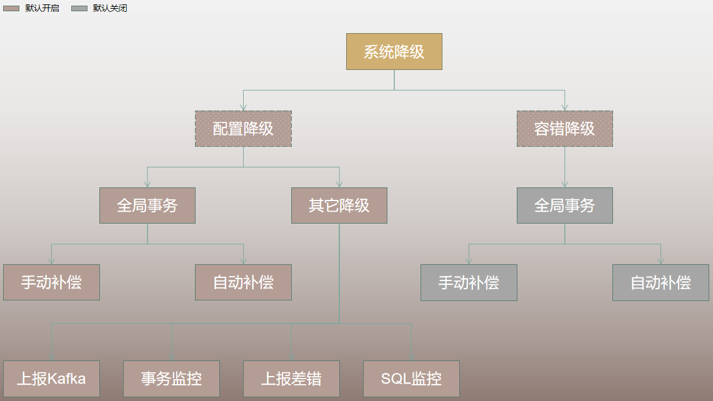

### 全局事务服务降级

+ 简介

  大部分框架和中间件在设计初期均应考虑后续对主业务的影响最小化，txle严格遵守该原则，提供服务降级功能。
  在程序运行时的多个阶段都可对全局事务进行降级或半降级，以及降级后的恢复功能，这在很大意义上保证了业务的正常运行。

+ 背景

  **性能影响**：当全局事务严重影响业务系统性能，且业务数据一致性要求不严苛时，可对全局事务采取降级处理。

  **Bug**：当全局事务运行过程中出现bug时，未能保证业务数据不一致时，如未能及时定位问题与修复，可对全局事务采取降级处理。

  **异常**：当全局事务运行过程中出现异常时，会回滚所涵盖的子业务功能，导致业务无法正常进行，可对全局事务采取降级处理。

  **特殊情况**：除全局事务外，系统内其他主要功能，如监控、Kafka集成、差错平台等功能也提供了降级处理，主要作用都是在特殊情况不影响业务的正常运行。

+ 配置中心数据表

  

  ```sql
  CREATE TABLE IF NOT EXISTS Config (
  id bigint NOT NULL AUTO_INCREMENT,
  servicename varchar(100),
  instanceid varchar(100),
  type int(2) NOT NULL DEFAULT 0 COMMENT '1-globaltx, 2-compensation, 3-autocompensation, 4-bizinfotokafka, 5-txmonitor, 6-alert, 7-schedule, 8-globaltxfaulttolerant, 9-compensationfaulttolerant, 10-autocompensationfaulttolerant, 50-accidentreport, 51-sqlmonitor  if values are less than 50, then configs for server, otherwise configs for client.',
  status int(1) NOT NULL DEFAULT 0 COMMENT '0-normal, 1-historical, 2-dumped',
  ability int(1) NOT NULL DEFAULT 1 COMMENT '0-do not provide ability, 1-provide ability     ps: the client''s ability inherits the global ability.',
  value varchar(100) NOT NULL,
  remark varchar(500),
  updatetime datetime NOT NULL DEFAULT CURRENT_TIMESTAMP,
  PRIMARY KEY (id) USING BTREE,
  UNIQUE INDEX pk_id(id) USING BTREE,
  INDEX index_type(type) USING BTREE
  ) DEFAULT CHARSET=utf8;
  ```

+ 配置管理

  理应参考配置中心相关文档（暂未开发）。

  提供展示UI，读取配置表数据并展示。

  添加时，客户端名称和实例ID从全局事件数据表中读取。

  由于数据量不大，故更新时先将原数据置为历史数据，再插入新数据。

  删除全部为逻辑删除，即删除后状态变为历史数据。

+ 降级类型
  + 配置降级

    即通过配置对部分功能进行降级处理与否。

    系统提供部分核心功能的降级配置，当功能对应的配置值被设置为disabled时，则说明此功能被设置为降级处理，即程序暂停提供此功能直至解除降级。若程序运行一切正常，可通过设置配置值为enabled解除降级。

    当然，降级配置值不仅仅包含disabled，后续会增设其它值，如范围值等。

  + 容错降级

    即全局事务系统运行过程中发生异常时，为不影响业务正常运行，将当前异常捕获掉，不回滚子业务已提交的事务。

    容错降级也支持配置，即如果启用了相应功能的容错降级才会对异常进行捕获。

+ 降级配置

  **服务器端降级配置**：全局事务、手动补偿、自动补偿、Kafka集成、事务监控、告警、定时器。

  **容错降级配置**：全局事务容错、手动补偿容错、自动补偿容错。

  **客户端降级配置**：上报差错、SQL监控。

  ps：降级是概念上的，而真实的系统配置是针对实际的功能十分支持。  
  如针对降级配置，开启全局事务，意思是业务系统使用全局事务，关闭则是业务系统不使用全局事务；  
  如针对容错降级，开启全局事务是发生错误时，将进行容错，即不对子事务进行回滚，关闭时，如果发送错误，则会对子事务进行回滚操作；
  
  

  **全局事务：**

    在全局事务启动前会先检测是否启用全局事务配置，如配置值为disabled则不启动全局事务，直接执行业务。  
    每个全局事务启动前都会检查，以达到降级配置实时生效。已在运行的不受影响。

  **手动补偿：** 同上。在启动子事务前检测。

  **自动补偿：** 同上。

  **Kafka集成：** 同上。在发送Kafka消息前检测。

  **事务监控：** 在启用监控前检测。

  **告警：** 暂未开发，可在Prometheus的配置文件中进行配置启用/禁用。

  **定时器：** 暂未开发，目前已有定时器均针对所有客户端，故不便于降级。

  **全局事务容错：** 在全局事务启动至结束代码处的异常捕获中增设容错降级功能，依据是否启用全局事务容错降级配置进行容错降级处理。

  **手动补偿容错：** 同上。在手动补偿对应的子事务代码处。

  **自动补偿容错：** 同上。在自动补偿对应的子事务代码处。

  **上报差错：** 发生消息到差错平台前检测，依据该功能的降级配置值决定是否继续上报。

  **SQL监控：** 客户端业务执行过程中，如果开启全局事物则在手动补偿或自动补偿子事务启动前检测当前配置值，如果未开启全局事物则在业务执行前检测。

+ 降级逻辑

  系统针对部分核心功能提供降级配置。

  默认除容错降级配置为disabled，其它降级配置值均为enabled。

  每项配置都分为全局配置和客户端配置，全局配置提供是否支持某功能。若不支持，则采用全局默认值；若支持，优先客户端配置，客户端未配置则采用全局默认值；私有配置值不能超出全局配置值范围。

  相关功能执行前，依据其对应的降级配置决定是否继续执行该功能。

  由于降级需求往往都比较急迫，故所有配置均提供实时生效功能。

  各配置检测时机不同，参考设计原则是“保证实时失效，节省性能”。
