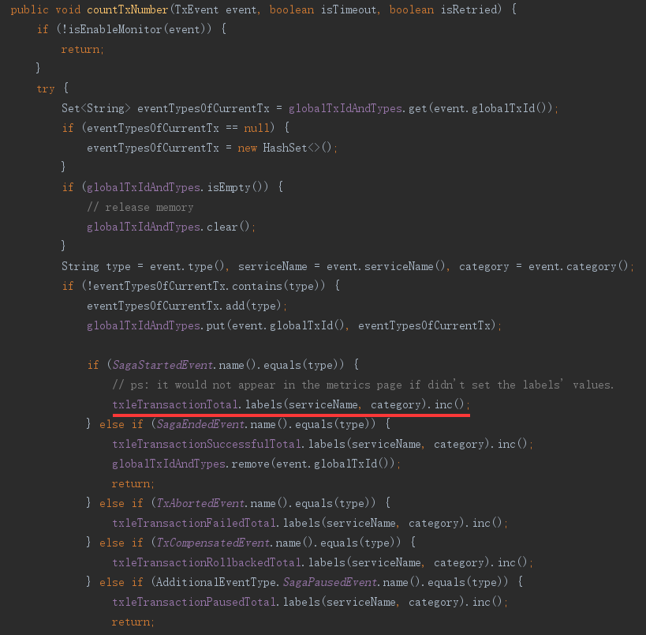

# 监控与告警

## 简介

&nbsp;&nbsp;&nbsp;&nbsp;监控主要对系统中的一些重要指标进行采集，采集后可友好地展示在UI中，便于后续对系统的性能、吞吐、稳定性等整体分析。  
&nbsp;&nbsp;&nbsp;&nbsp;告警是依据采集的指标配合相关公式设计的告警规则，可及时地发现系统以及服务器存在的问题，避免时间长未处理而酿成重大后果。  
&nbsp;&nbsp;&nbsp;&nbsp;除本系统重要指标外，也包括JVM、CPU、内存、磁盘和网络等。

## txle监控指标

### **TXLE项目**

#### **全局事务数量**

&nbsp;&nbsp;&nbsp;&nbsp;成功数量 - **txle_transaction_total**  
&nbsp;&nbsp;&nbsp;&nbsp;失败数量 - **txle_transaction_failed_total**  
&nbsp;&nbsp;&nbsp;&nbsp;回滚数量 - **txle_transaction_rollbacked_total**  
&nbsp;&nbsp;&nbsp;&nbsp;超时数量 - **txle_transaction_timeout_total**  
&nbsp;&nbsp;&nbsp;&nbsp;重试数量 - **txle_transaction_retried_total**  
&nbsp;&nbsp;&nbsp;&nbsp;暂停数量 - **txle_transaction_paused_total**  
&nbsp;&nbsp;&nbsp;&nbsp;继续数量 - **txle_transaction_continued_total**  
&nbsp;&nbsp;&nbsp;&nbsp;自动继续数量 - **txle_transaction_autocontinued_total**

&nbsp;&nbsp;&nbsp;&nbsp;采用Prometheus的Counter类型统计，部分代码如下：




#### **子事务数量**

&nbsp;&nbsp;&nbsp;&nbsp;**指标名称：txle_transaction_child_total**

&nbsp;&nbsp;&nbsp;&nbsp;采用Prometheus的Counter类型统计，部分代码如下：


#### **全局事务时长**

&nbsp;&nbsp;&nbsp;&nbsp;**指标名称：txle_transaction_time_seconds_total**


#### 子事务时长

&nbsp;&nbsp;&nbsp;&nbsp;**指标名称：txle_transaction_child_time_seconds_total**

&nbsp;&nbsp;&nbsp;&nbsp;同全局事务时长，将globalTxId改为localTxId。

#### **业务SQL时长与数量**

&nbsp;&nbsp;&nbsp;&nbsp;**指标名称：txle_sql_time_seconds_total、txle_sql_total**

&nbsp;&nbsp;&nbsp;&nbsp;即业务应用系统执行的SQL。  
&nbsp;&nbsp;&nbsp;&nbsp;标准业务SQL统计时已依据业务和事务类别分组。  
&nbsp;&nbsp;&nbsp;&nbsp;未分组的业务SQL主要包含：自动补偿SQL。  
&nbsp;&nbsp;&nbsp;&nbsp;注：当某子业务被成功**回滚**时，对应的**txle_sql_total**会有**7**条，即针对当前子事务会有如下操作“开启事务、结束事务、查询回滚状态、新增待完成的回滚命令、新增回滚事件、更新回滚命令为完成、更新全局事务结束事件”。

#### **维护SQL时长与数量**

&nbsp;&nbsp;&nbsp;&nbsp;**指标名称：txle_sql_time_seconds_total、txle_sql_total**

&nbsp;&nbsp;&nbsp;&nbsp;即TXLE项目执行的SQL，含Client端自动补偿相关维护SQL和Server端的维护(或所有)SQL。  
&nbsp;&nbsp;&nbsp;&nbsp;标准维护SQL统计时已依据业务和事务类别分组。  
&nbsp;&nbsp;&nbsp;&nbsp;未分组的维护SQL主要包含：Client端自动补偿SQL、Server端部分定时器SQL(无全局事务标识参数的)、超时和补偿事件SQL。

### **JVM**

&nbsp;&nbsp;&nbsp;&nbsp;采用prometheus自带统计方式：  
&nbsp;&nbsp;&nbsp;&nbsp;io.prometheus.client.hotspot.**DefaultExports.initialize**();

### **CPU、内存、磁盘、网络**

&nbsp;&nbsp;&nbsp;&nbsp;安装第三方工具**Node exporter**来统计指标。

# **TXLE默认Prometheus客户端服务端口**

## **TXLE Server端默认Prometheus端口8099**

&nbsp;&nbsp;&nbsp;&nbsp;默认端口逻辑：默认端口配置在**application.yaml**文件中，所以程序中获取到的任何值均可认为是维护人员主动编辑，所以在程序层面如果获取到无效值，则意味着不启动Prometheus客户端监控服务。

**application.yml**

```yaml
txle:
  prometheus:
    metrics:
      port: 8099
```

## **TXLE Client端默认Prometheus端口8098**

&nbsp;&nbsp;&nbsp;&nbsp;默认端口逻辑：Client与Server不一样，Client端的默认端口只能写在**Java代码**中。因为Client端的Prometheus服务端口需由集成业务进行设置，所以无法在Client端进行默认配置。

**application.yml**

```yaml
txle:
  prometheus:
    metrics:
      port: 8098
```

**application.properties**

```properties
txle.prometheus.metrics.port=8098
```
