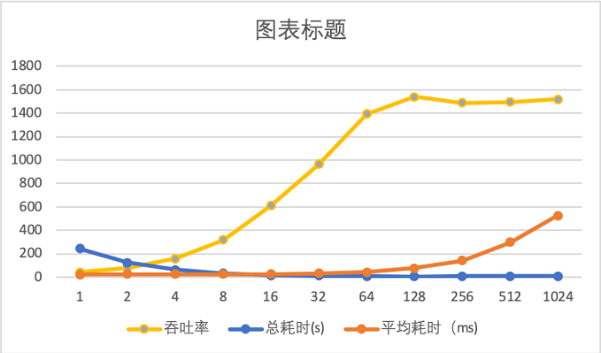

# 常见问题

## 是否支持docker快速部署？

支持常规部署、docker镜像部署、以及docker compose部署。

## QPS/TPS？

**txle QPS 指标**：

**ServiceComb Pack QPS指标**：

## 保证ACID么？

保证ACD，不保证隔离性。原因是产品的核心主要解决数据的最终一致性。

## 支持哪些数据库？

目前我们专注于MySQL，后期计划增加PostgreSQL等。

## 对数据库连接池有特殊要求么？

暂无特殊要求。

## 对于补偿方法的要求？

- 幂等
- 与被补偿方法在同一类且参数完全一致
- 参数可被序列化

## 是否支持事务嵌套？

支持子事件嵌套。

## txle server端支持水平扩展么？

支持。相关状态信息均存储于数据库。

## txle server宕机重启后，是否可继续当前全局事务？

可以继续当前全局事务。

## 对业务系统的性能影响？

单事务分支平均响应时间在2ms左右。
