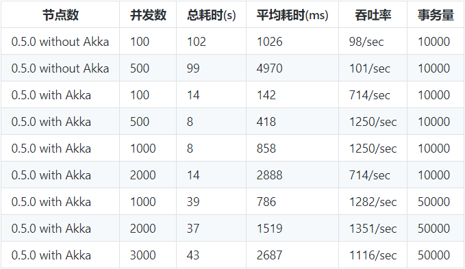

# 常见问题

## 5.1 是否支持docker快速部署？

[<u>支持常规部署</u>](https://actiontech.github.io/txle-docs-cn/1.QuickStart/1.1_deployment.html)、[<u>docker镜像部署</u>](https://actiontech.github.io/txle-docs-cn/1.QuickStart/1.2_docker_image_deployment.html)、[<u>以及docker compose部署</u>](https://actiontech.github.io/txle-docs-cn/1.QuickStart/1.3_docker_compose_deployment.html)。

## 5.2 QPS/TPS？

**txle QPS 指标**：

|  并发数 | 总耗时(s) | 平均耗时（ms) | 吞吐率 | 事务量 |
| ------- | --------- | ------------- | ------- | ------ |
| 100     | 38.031    | 36.27         | 2628.33 | 100000 |
| 500     | 38.271    | 181.01        | 2611.92 | 100000 |
| 1000    | 47.606    | 460.15        | 2099.69 | 100000 |
| 1250    | 47.615    | 575.74        | 2098.9  | 100000 |
| 1500    | 48.449    | 694.76        | 2073.28 | 100000 |
| 2000    | 49.019    | 914.19        | 2038.99 | 100000 |

**ServiceComb Pack QPS指标**：

## 5.3 对业务系统的性能影响？

单事务分支平均响应时间在2ms左右。

## 5.4 保证ACID么？

保证ACD，不保证Isolation。

**那支持并发场景么？或并发场景会存在什么隐患么？**

当然支持并发场景。业务无任何异常情况并发场景完全ok；并发未更新同一数据，即使异常也可被补偿；并发更新同一数据时，若无异常完全ok，若最后的事务出现异常也可补偿；若非最后的事务出现异常但为计算型赋值也可补偿，若直接赋值将补偿失败，则将上报差错。

支持并发、支持补偿，支持部分并发补偿(并发时最后的事务异常可以被补偿，非最后事务会补偿失败，将上报差错)。

## 5.5 支持哪些数据库？

txle目前支持手动补偿机制和自动补偿机制。

手动补偿机制支持异构数据库，对数据库无要求。

自动补偿机制目前支持MySQL，其它数据库支持规划中。

## 5.6 对数据库连接池有特殊要求么？

暂无特殊要求。

## 5.7 对于补偿方法的要求？

- 幂等
- 与被补偿方法在同一类且参数完全一致
- 参数可被序列化

## 5.8 是否支持事务嵌套？

支持子事件嵌套。

## 5.9 txle server端支持水平扩展么？

支持。相关状态信息均存储于数据库。

## 5.10 txle server宕机重启后，是否可继续当前全局事务？

可以继续当前全局事务。
