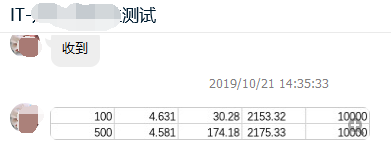

# 8.1 性能测试报告
## 8.1.1 关于本节
性能测试使用`jmeter`发送全局事务请求，txle服务端和业务端demo分别部署在物理服务器上的不同docker容器中

## 8.1.2 配置
### 8.1.2.1 物理服务器配置
| 名称     | 描述                                                       |
| -------- | --------------------------------------------------------- |
| 服务器   | Dell PowerEdge R740xd                                      |
| CPU      | Intel(R) Xeon(R) Gold 6148 CPU @ 2.40GHz                  |
| 核数     | 80                                                         |
| 内存     | 256G                                                       |
| 硬盘     | SSD                                                        |
| 网卡     | Intel Corporation I350 Gigabit Network Connection (rev 01) |

### 8.1.2.2 Docker版本
```bash
$ docker version
Client: Docker Engine - Community
 Version:           19.03.4
 API version:       1.40
 Go version:        go1.12.10
 Git commit:        9013bf583a
 Built:             Fri Oct 18 15:54:09 2019
 OS/Arch:           linux/amd64
 Experimental:      false

Server: Docker Engine - Community
 Engine:
  Version:          19.03.4
  API version:      1.40 (minimum version 1.12)
  Go version:       go1.12.10
  Git commit:       9013bf583a
  Built:            Fri Oct 18 15:52:40 2019
  OS/Arch:          linux/amd64
  Experimental:     false
 containerd:
  Version:          1.2.10
  GitCommit:        b34a5c8af56e510852c35414db4c1f4fa6172339
 runc:
  Version:          1.0.0-rc8+dev
  GitCommit:        3e425f80a8c931f88e6d94a8c831b9d5aa481657
 docker-init:
  Version:          0.18.0
  GitCommit:        fec3683
```

### 8.1.2.3 jmeter版本
```bash
$ jmeter --version
5.1.1 r1855137
```

### 8.1.2.4 txle服务端配置
```bash
java \
    -Djava.awt.headless=true \
    -Djava.net.preferIPv4Stack=true \
    -server -Xmx2g -Xms2g -Xmn256m \
    -XX:PermSize=128m \
    -Xloggc:/root/alpha-server/txle/log/gc-stdout.log \
    -XX:+DisableExplicitGC \
    -XX:+UseConcMarkSweepGC \
    -XX:+CMSParallelRemarkEnabled \
    -XX:+UseCMSCompactAtFullCollection \
    -XX:LargePageSizeInBytes=128m \
    -XX:+UseFastAccessorMethods \
    -XX:+UseCMSInitiatingOccupancyOnly \
    -XX:CMSInitiatingOccupancyFraction=70
    -jar txle-server-2.19.10.0.jar
    --spring.datasource.username=root \
    --spring.datasource.password=123456 \
    --spring.datasource.url="jdbc:mysql://172.20.0.11:3306/txle?characterEncoding=utf-8" \
    --spring.profile.active=mysql
```

## 8.1.3 测试报告
总结：
+ 吞吐率最高可达到每秒1539笔全局事务,每笔全局事务包含包含3个子事务
+ 本单节点Alpha最优并发量为 128～1024，平均耗<0.5s，吞吐率 1500+/秒
+ 本测试客户端和服务端分别部署在不同的docker容器中，模拟真实网络通讯
+ 本测试使用真实的springboot客户端，模拟真实的使用场景
+ 本测试使用jmeter分布式测试环境，模拟真实的压力场景

|  并发数  | 总耗时(s)  | 平均耗时（ms)  | 吞吐率   | 事务量  |
| ------- | --------- | ------------- | ------- | ------ |
| 1       | 243       | 23.41         | 41.18   | 10000  |
| 2       | 124       | 23.99         | 79.99   | 10000  |
| 4       | 63        | 24.06         | 158.67  | 10000  |
| 8       | 31        | 24.1          | 319.27  | 10000  |
| 16      | 16        | 24.71         | 611.28  | 10000  |
| 32      | 10        | 30.61         | 963.45  | 10016  |
| 64      | 7.208     | 41.84         | 1392.85 | 10048  |
| 128     | 6.456     | 75.13         | 1539.79 | 9984   |
| 256     | 6.684     | 140.74        | 1488.37 | 9984   |
| 512     | 6.791     | 297.13        | 1494.24 | 10240  |
| 1024    | 6.724     | 524.5         | 1517.71 | 10240  |

The latest result for performance testing.  

